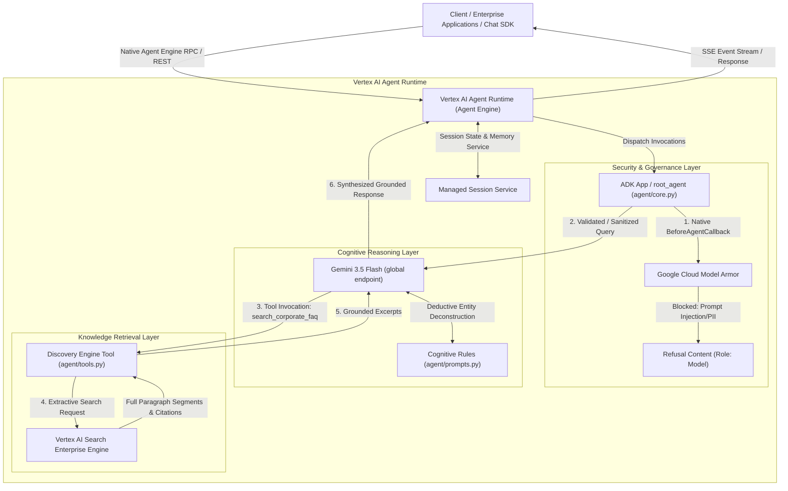
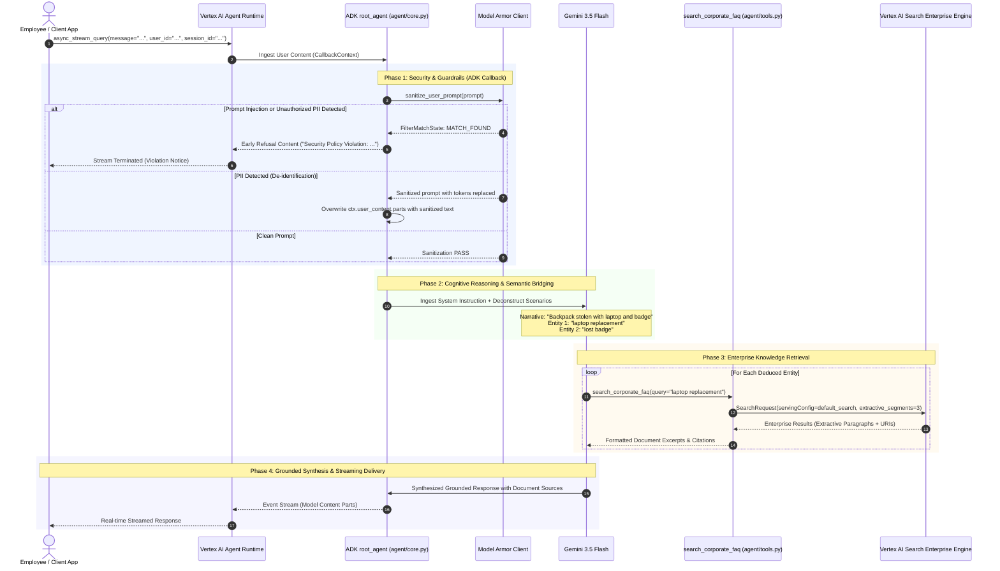

# Enterprise Corporate FAQ Agent

A production-ready Enterprise Corporate FAQ Agent built with the **Google Agent Development Kit (ADK 2.x)** and the **Google GenAI SDK**, running natively on the **Vertex AI Agent Runtime (Agent Engine)**. Integrated with **Vertex AI Search (Enterprise Edition)** for full-paragraph extractive policy retrieval and **Google Cloud Model Armor** for real-time prompt protection, injection defense, and PII de-identification.

Vertex AI Agent Runtime natively manages serving, HTTP endpoints, streaming responses (`async_stream_query`), and distributed session/memory state without requiring custom web wrappers (FastAPI, Uvicorn).

---

## Architecture Overview



### Core Architecture Highlights

- **Core Framework**: [Google Agent Development Kit (ADK 2.x)](https://github.com/google/agent-development-kit) (`google-adk`) utilizing `Agent`, `App`, `Runner`, and native lifecycle hooks (`before_agent_callback`).
- **Managed Runtime**: Vertex AI Agent Runtime / Agent Engine managing container lifecycles, HTTP/RPC routing, auto-scaling, and persistent session state.
- **Foundation Model**: Gemini 3.5 (`gemini-3.5-flash`) via the modern unified `google-genai` SDK targeting the Vertex AI `global` location endpoint.
- **Enterprise Knowledge Retrieval**: Vertex AI Search (Enterprise Edition) querying enterprise document engines via `collections/default_collection/engines/{engine_id}/servingConfigs/default_search` with full-paragraph extractive segments and extractive answers.
- **Security & Governance**: Google Cloud Model Armor integration directly hooked into ADK's `before_agent_callback` for prompt injection screening, jailbreak detection, and sensitive PII de-identification.
- **Deductive Reasoning**: Multi-intent scenario deconstruction mapping compound narratives (e.g., lost badge + stolen laptop) into targeted, canonical 1-to-3 word keyword queries with partial answer synthesis and fallback routing.

---

## Detailed System Execution Flow



---

## Repository Structure

```
.
├── enterprise_faq_agent/
│   ├── __init__.py               # Package exports (root_agent, app, agent, tools, prompts)
│   ├── agent.py                  # Agent entry point for ADK Agent Loader
│   ├── core.py                   # Native ADK Agent, Model Armor guardrail callback, module-level agent instance
│   ├── config.py                 # Self-contained environment settings & .env auto-discovery
│   ├── prompts.py                # System instructions & deductive reasoning directives
│   ├── tools.py                  # Vertex AI Search Enterprise tool with extractive segments
│   ├── root_agent.yaml           # Declarative ADK agent configuration
│   ├── requirements.txt          # Agent package dependencies for Agent Engine container build
│   ├── .agent_engine_config.json # Agent Engine deployment settings and environment variables
│   ├── .env                      # Local environment secrets (gitignored)
│   └── .env.example              # Sample environment template
├── requirements.txt              # Application dependencies (references package requirements)
├── requirements-dev.txt          # Development and testing dependencies (pytest, black, flake8)
└── tests/
    ├── test_agent.py             # Agent initialization & Model Armor test suite
    ├── test_agent_runtime.py     # Native ADK Agent Runtime & callback test suite
    ├── test_config.py            # Configuration validation tests
    └── test_tools.py             # Vertex AI Search Enterprise tool & deduplication tests
```

---

## Configuration & Environment Variables

| Variable | Type | Default | Description |
| :--- | :--- | :--- | :--- |
| `GOOGLE_CLOUD_PROJECT` | `string` | *(Required)* | Google Cloud Project ID (e.g. `your-project-id`) |
| `GOOGLE_CLOUD_LOCATION` | `string` | `global` | Vertex AI Model Location |
| `GEMINI_MODEL` | `string` | `gemini-3.5-flash` | Foundation LLM model name |
| `DISCOVERY_ENGINE_PROJECT_ID` | `string` | `${GOOGLE_CLOUD_PROJECT}` | Discovery Engine GCP Project ID |
| `DISCOVERY_ENGINE_LOCATION` | `string` | `global` | Search Engine location |
| `DISCOVERY_ENGINE_ID` / `ENGINE_ID` | `string` | `your-engine-id` | Vertex AI Search Enterprise Engine ID |
| `DISCOVERY_ENGINE_SERVING_CONFIG_ID` | `string` | `default_search` | Engine serving configuration ID |
| `MODEL_ARMOR_ENABLED` | `boolean` | `false` | Enable/disable Model Armor prompt screening |
| `MODEL_ARMOR_LOCATION` | `string` | `us-central1` | Model Armor regional endpoint |
| `MODEL_ARMOR_TEMPLATE_ID` | `string` | `faq-security-template` | Security template ID for screening |

---

## Deployment to Vertex AI Agent Runtime

### Method 1: Using the ADK CLI (Recommended)

The Google ADK CLI provides native deployment directly to Vertex AI Agent Engine (Reasoning Engine):

```bash
# 1. Authenticate with Google Cloud
gcloud auth login
gcloud auth application-default login

# 2. Deploy the agent package directly to Vertex AI Agent Engine
adk deploy agent_engine \
  --project="your-project-id" \
  --region="us-central1" \
  --display_name="enterprise-faq-agent" \
  --description="Enterprise Corporate HR & IT Assistant powered by Vertex AI Search Enterprise" \
  enterprise_faq_agent
```

### Method 2: Update an Existing Agent Engine Instance

If you are updating an existing Reasoning Engine instance ID:

```bash
adk deploy agent_engine \
  --project="your-project-id" \
  --region="us-central1" \
  --agent_engine_id="<EXISTING_AGENT_ENGINE_ID>" \
  enterprise_faq_agent
```

### Method 3: Deploying via Google Cloud CLI (`gcloud`)

For continuous integration (CI/CD) pipelines utilizing `gcloud`:

```bash
# Set deployment variables
PROJECT_ID="your-project-id"
REGION="us-central1"

# Package and deploy reasoning engine container / artifact
gcloud ai reasoning-engines create \
  --project="${PROJECT_ID}" \
  --region="${REGION}" \
  --display-name="enterprise-faq-agent" \
  --description="Enterprise Corporate HR and IT FAQ Assistant"
```

---

## Local Development & Testing

### 1. Interactive CLI Mode

Run the agent interactively in the terminal using ADK:

```bash
GOOGLE_GENAI_USE_ENTERPRISE=1 \
GOOGLE_CLOUD_PROJECT=your-project-id \
GOOGLE_CLOUD_LOCATION=global \
adk run enterprise_faq_agent
```

### 2. Single-Query Execution

Execute a single-turn query against Vertex AI Search Enterprise:

```bash
GOOGLE_GENAI_USE_ENTERPRISE=1 \
GOOGLE_CLOUD_PROJECT=your-project-id \
GOOGLE_CLOUD_LOCATION=global \
adk run --in_memory enterprise_faq_agent "What is the standard PTO policy?"
```

### 3. Local ADK API Server & Web UI

Launch the ADK Web UI or API server for local testing:

```bash
# Start ADK Web UI
adk web .

# Or start the headless ADK API Server
adk api_server --port=8080 --host=0.0.0.0 .
```

---

## Automated Test Suite

Run the full pytest suite (20 automated tests validating tools, configuration, Model Armor, and native ADK runtime integration):

```bash
PYTHONPATH=. pytest tests -v
```
